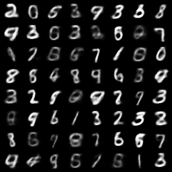
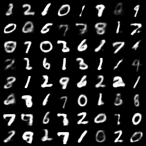
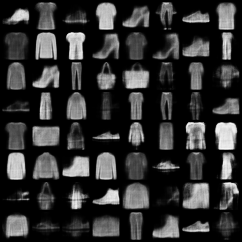
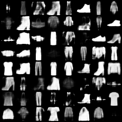

# rho_VAE:

A repo dedicated to our paper [$\rho$-VAE: Autoregressive parametrization of the VAE encoder](https://arxiv.org/abs/1909.06236)

## Main idea:

We replace the usual diagonal Gaussian parametrization of the approximate posterior in VAE models with autoregressive Gaussian.

### The usual way:

In standard VAE models, any input training sample is inducing an approximate posterior with a diagonal Gaussian distribution, i.e., $q_{\phi}(\mathbf{z}|\mathbf{x}^{(i)}) = \mathcal{N} \big( \boldsymbol{\mu}^{(i)}, \text{diag} (\mathbf{s}^{(i)})  \big)$ to the latent space. This is realized by a linear layer that is outputing the mean vector $\boldsymbol{\mu}^{(i)}$ of this distribution for the $i^{\text{th}}$ sample, and another linear layer that is creating the $\log{\mathbf{s}^{(i)}}$, i.e., the logarithm of the diagonal elements of the covariance matrix for the $i^{\text{th}}$ sample.

Next step is to generate samples from this distribtion. The reparametrization trick is then used to generate latent codes as $\mathbf{z}^{(i)} = \boldsymbol{\mu}^{(i)} + \sqrt{\mathbf{s}^{(i)}} \odot \boldsymbol{\epsilon}$, where $\odot$ is the element-wise multiplication of the variance vector $\mathbf{s}^{(i)}$, with another vector of random samples generated on the fly from the zero-mean and unit-variance normal distribution. Note that this comes from the fact that the Choleskiy factorization of the diagonal covariance is another diagonal matrix whose diagonal elements are the square-root of the diagonal elements of the covariance matrix.

So in order to keep things practical, one important restriction in the choice of how to parametrize the approximate posterior distribution is to have a straightforward Choleskiy factorization of its covariance, such that it can be constructed parametrically and without having to numerically calculate it.

From the other hand, we also need to calculate the KL-divergence between this approximate posterior and the prior for the latent space, which is usually a zero-mean and unit-variance Gaussian distribution. In order to avoid many issues and further complications, we would rather have this KL-divergence term calculated in closed-form and again parametrically. This way we can easily back-propagate the gradients of the weights of the network.

With this standard diagonal Gaussian choice, this can be derived as:

$$ D_{\text{KL}}\Big[ \mathcal{N} \Big( \boldsymbol{\mu}^{(i)}, \text{diag} \big( \mathbf{s}^{(i)} \big) \Big)    \Big|\Big|  \mathcal{N} \big( \mathbf{0}, \mathrm{I}_d \big)  \Big] = \frac{1}{2} \Big[ \mathbf{1}_d^T \mathbf{s}^{(i)} + \big|\big| \boldsymbol{\mu}^{(i)} \big|\big|_2^2 -d -  \mathbf{1}_d^T \log \big({\mathbf{s}^{(i)}} \big) \Big].$$

However, while very handy, this way of parametrization may be too simple to approximate the posterior. Note that it does not allow any correlation within the dimensions of the posterior. It just lets each dimension scale arbitrarily and independent of the other dimensions, a freedom which may even be not very necessary, since variances in the pixel domain are usually within the same range.

### The rho_VAE way:

We propose to construct the covariance matrix of the approximate posterior differently. In particular, we account for the correlation through the simplest possible way, i.e., an AR(1) process with the covariance parametrized as:

$$\mathrm{C}_{(\rho,s)} = s \times  \text{Toeplitz} \Big([1,\rho, \rho^2, \cdots, \rho^{d-1}] \Big)
= s \begin{bmatrix}
    1          & \rho        & \rho^2     & \rho^3       & \cdots   & \rho^{d-1} \\
    \rho       & 1           & \rho       & \rho^2       & \cdots   & \rho^{d-2} \\
    \rho^2     & \rho        & 1          & \rho         & \cdots   & \rho^{d-3} \\
    \rho^3     & \rho^2      & \rho       & 1            & \cdots   & \rho^{d-4} \\
    \vdots     &       &       & \ddots       & \ddots   & \vdots      \\
    \rho^{d-1} & \cdots  & \rho^3 & \rho^2   & \rho   & 1
  \end{bmatrix},$$
  
where $-1 < \rho < +1$ is a scalar value that controls the level of correlation and $s$ is another scalar that scales the whole covariance.

These two scalars can be constructed as outputs of two linear layers, each of size $d' \times 1$ (so $\frac{d}{2}$ times less parameters than the standard way for this layer). Since we want the correlation coefficient to have magnitude less than one (both positive and negative), we pass the output of the first layer through a $\tanh{\cdot}$ activation. And similarly to the standard way, the output of the other layer is assumed to be the log of the positive scaling factor. 


As far as the practical issues of optimization are concerned, fortunately, this is as convenient as the standard way. The Choleskiy factorization of this covariance is parametric and has the form:

$$\tilde{\mathrm{C}}_{(\rho,s)} = \frac{1}{\sqrt{s}} \begin{bmatrix}
    1          & 0        & 0     & 0       & 0   & 0 \\
    \rho       & \sqrt{1-\rho 2}           & 0       & 0       & \cdots   & 0 \\
    \rho^2     & \rho\sqrt{1-\rho 2}        & \sqrt{1-\rho 2}          & 0         & \cdots   & 0 \\
    \rho^3     & \rho^2\sqrt{1-\rho 2}      & \rho\sqrt{1-\rho 2}       & \sqrt{1-\rho 2}           & \cdots   & 0 \\
    \vdots     &       &       & \ddots       & \ddots   & \vdots      \\
    \rho^{d} & \cdots  & \rho^3 \sqrt{1-\rho 2} & \rho^2 \sqrt{1-\rho 2}   & \rho \sqrt{1-\rho 2}   & \sqrt{1-\rho 2}
  \end{bmatrix},$$
which has structure similar to the coariance matrix itself.
  
As for the KL-divergence term, this also comes in closed-form as:

$$D_{\text{KL}}\Big[ \mathcal{N} \Big( \boldsymbol{\mu}^{(i)}, \mathrm{C}_{(\rho,s)} \Big)    \Big|\Big|  \mathcal{N} \big( \mathbf{0}, \mathrm{I}_d \big)  \Big] = \frac{1}{2} \Big[
\big|\big| \boldsymbol{\mu}^{(i)} \big|\big|_2^2 + d(s-1-\log{(s)})  - (d-1)\log{(1 - \rho^2)}  
\Big].$$


## In essence: a drop-in replacement for the usual encoder:

As far as the implementation of our idea is concerned, concretely, we only make the following 3 changes:

1. Replacing the fully-connected linear layer of size ``(h_sim,z_dim)`` that outputs ``logvar`` with two linear layers of size ``(h_dim,1)``. The first one is passed through a ``tanh`` non-linearity anf outputs the correlation coefficient ``rho``, and the second one (without any non-linearity) is outputing the logarithm of the scaling factor, i.e., ``log_s``.

2. Changing the reparametrization function from 

```python
def reparameterize(self, mu, logvar):
    std = torch.exp(0.5*logvar)
    eps = torch.randn_like(std)
    z_q = mu + eps*std
    return z_q
    ```

to:

```python
def reparameterize(self, mu, rho, logs):

    z_q = torch.randn_like(rho).view(-1,1) * torch.sqrt(logs.exp())
    for j in range(1,z_dim):
        addenum = z_q[:,-1].view(-1,1)  + torch.randn_like(rho).view(-1,1) * torch.sqrt(logs.exp())
        z_q = torch.cat(( z_q, addenum ),1)        
    z_q  = z_q + mu  
    return z_q 
    ```

Note that this is equivalent to generation by matrix-vector multiplication of the choleskiy form above with the vector ``eps``. The reason we chose this direct form is that Toeplitz matrices are not yet implemented in PyTorch and we need a for-loop to ralize the AR(1) process in practice. This, however, does not bring any slow-down and we notice that the ``rho_VAE`` runs as fast as the baseline.

3. Changing the Kulback-Leibler divergence term in the loss from

``KLD = -0.5 * torch.sum(1 + logvar - mu.pow(2) - logvar.exp()) ``

to: 

``KLD = 0.5 * ( torch.sum(mu.pow(2)) + - z_dim * logs - (z_dim - 1) * torch.log(1 - rho**2) +  z_dim * (logs.exp()-1)).mean()``.

Note that these are exactly equivalent quantities that have the same range. Only the first one is valid when the approximate posterior is diagonal and the second one is valid when it is AR(1).


These 3 changes can be applied in a plug-and-play manner, meaning wherever relevant, replacing the usual way with this $\rho$-way is expected to produce better results. So no parameters to tune!


## Some generated samples:

Here are some samples generated after the above changes, while keeping all other things the same:

On mnist,

Vanilla-VAE:

rho-VAE:


and on fashion-mnist,

Vanilla-VAE:

rho-VAE:



## Citation:

Here is how to cite this work:

```
@misc{ferdowsi2019vae,
    title={$ρ$-VAE: Autoregressive parametrization of the VAE encoder},
    author={Sohrab Ferdowsi and Maurits Diephuis and Shideh Rezaeifar and Slava Voloshynovskiy},
    year={2019},
    eprint={1909.06236},
    archivePrefix={arXiv},
    primaryClass={cs.LG}
}
```
